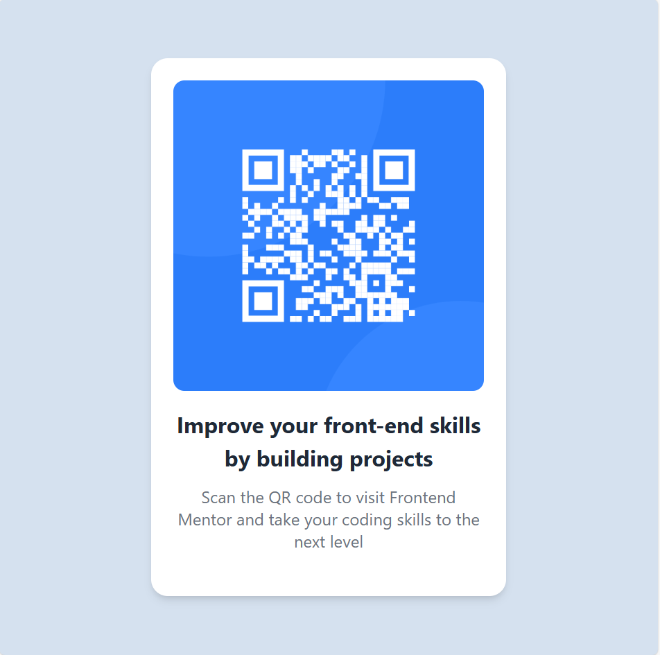

# Frontend Mentor - QR Code Component Solution

Cette solution répond au défi [QR Code Component](https://www.frontendmentor.io/challenges/qr-code-component-iux_sIO_H) proposé sur Frontend Mentor. Ce type de défi permet d'améliorer ses compétences en développement front-end en réalisant des projets concrets.

## Aperçu

### Capture d'écran

### Liens

- Solution : [Ajoute l'URL ici](https://github.com/LINDECKER-Charles/QR_code_component/blob/main/index.html)
- Site en ligne : [Ajoute l'URL du site ici]()

## Processus de développement

### Conçu avec

- **HTML5 sémantique** pour une structure claire.
- **CSS avec Tailwind CSS** pour un design rapide et réactif.
- **Flexbox** pour un positionnement fluide.
- **Approche Mobile-First** pour une meilleure adaptation sur tous les écrans.

### Ce que j’ai appris

Ce projet m’a permis de renforcer mes compétences sur :
- La gestion des styles avec Tailwind CSS.
- L’optimisation de la mise en page avec Flexbox.
- La structuration d’un composant réactif.

### Améliorations futures

J’aimerais améliorer :
- L'accessibilité du composant.
- L’optimisation des performances CSS.
- Ajouter des animations légères pour améliorer l’expérience utilisateur.

### Ressources utiles

- [Tailwind CSS Documentation](https://tailwindcss.com/docs)
- [MDN Flexbox Guide](https://developer.mozilla.org/en-US/docs/Learn/CSS/CSS_layout/Flexbox)
- [Frontend Mentor](https://www.frontendmentor.io)

## Auteur

- **Frontend Mentor** - [@LINDECKER-Charles](https://www.frontendmentor.io/profile/LINDECKER-Charles)
- **LinkedIn** - [Charles LINDECKER](https://www.linkedin.com/in/charles-lindecker/)
